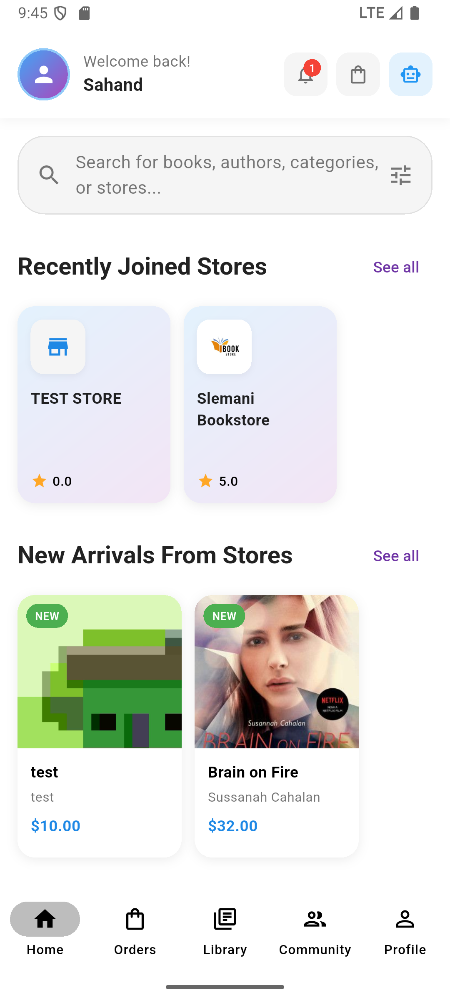
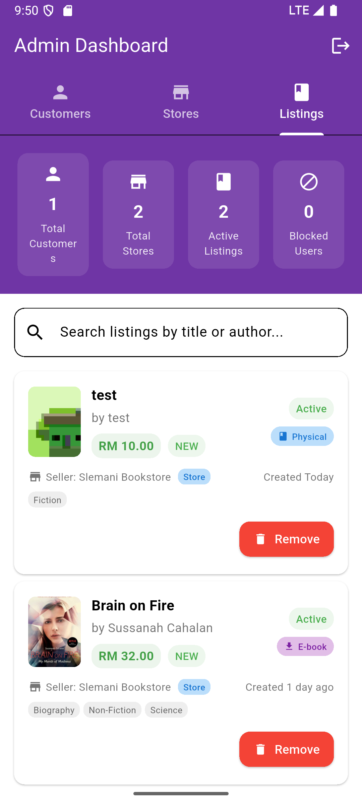

# Pertukekem

## Introduction

Pertukekem is a next-generation, AI-powered online bookstore and digital library platform designed to revolutionize the way readers, store owners, and administrators interact with books and each other. Built with Flutter and Firebase, Pertukekem combines a beautiful, modern user interface with robust backend services, real-time notifications, and advanced AI features. Whether you're a book lover searching for your next read, a store owner managing inventory and orders, or an admin overseeing the ecosystem, Pertukekem provides a seamless, secure, and engaging experience for all.

---

## Table of Contents

- [Features](#features)
- [Project Structure](#project-structure)
- [Getting Started](#getting-started)
- [Firebase & Cloud Functions](#firebase--cloud-functions)
- [Security](#security)
- [Screenshots](#screenshots)
- [Contributing](#contributing)

---

## Features

- **AI Chat Assistant**: Get instant book recommendations, summaries, and bookstore navigation help powered by Google AI/Vertex AI. The AI assistant is context-aware and tailored for book-related queries.
- **Multi-role Authentication**: Secure sign-up and login for customers, store owners, and admins, each with custom dashboards and flows.
- **Order Management**: Place, track, and manage orders for both buyers and sellers, with real-time status updates and notifications.
- **Store Setup & Management**: Guided onboarding for new stores, including image uploads, contact setup, and store profile management.
- **Push Notifications**: Real-time updates for order status, new store creation, and more via Firebase Cloud Messaging and custom Cloud Functions.
- **Digital Library**: Manage, read, and track eBooks and physical books. Includes a digital bookshelf, reading progress, and eBook reader integration.
- **Community & Ratings**: Engage with other readers, rate stores, participate in discussions, and join the Pertukekem community.
- **Secure Payment Cards**: Store and manage payment cards with advanced Firestore security rules and validation.
- **Admin Dashboard**: Powerful tools for administrators to manage users, stores, and platform-wide settings.
- **Mobile-First Design**: Responsive, beautiful UI for Android and iOS, with support for web and desktop coming soon.

---

## Project Structure

```
pertukekem/
├── android/           # Android native project
├── ios/               # iOS native project
├── lib/               # Main Flutter/Dart source code
│   ├── core/          # Core services, theme, router
│   ├── features/      # Feature modules (AI, auth, orders, etc.)
│   └── firebase_options.dart # Firebase config
├── functions/         # Firebase Cloud Functions (Node.js)
├── assets/            # Images, fonts, etc.
├── test/              # Widget and integration tests
├── pubspec.yaml       # Dart/Flutter dependencies
├── firebase.json      # Firebase project config
└── firestore_security_rules_cards.rules # Firestore security rules
```

---

## Getting Started

### Prerequisites

- [Flutter SDK](https://flutter.dev/docs/get-started/install)
- [Firebase CLI](https://firebase.google.com/docs/cli)
- Node.js (for Cloud Functions)

### Installation

1. **Clone the repository:**
   ```bash
   git clone https://github.com/yourusername/pertukekem.git
   cd pertukekem
   ```
2. **Install Flutter dependencies:**
   ```bash
   flutter pub get
   ```
3. **Configure Firebase:**
   - Ensure `firebase.json` and `lib/firebase_options.dart` are set up for your Firebase project.
   - Place your `google-services.json` in `android/app/`.
4. **Install Cloud Functions dependencies:**
   ```bash
   cd functions
   npm install
   cd ..
   ```
5. **Run the app:**
   ```bash
   flutter run
   ```

---

## Firebase & Cloud Functions

- **Cloud Functions** are located in the `functions/` directory and handle:
  - Push notifications for order updates and new store creation
  - Automated cleanup of invalid FCM tokens
  - Welcome notifications for new store owners
  - Order status change triggers
- **Firestore Security Rules** are provided for secure payment card storage and user data protection.
- **Firebase Messaging** is integrated for real-time notifications and seamless user engagement.
- **Authentication** uses Firebase Auth for secure, scalable user management.

---

## Security

- User authentication and role-based access control for all features
- Firestore security rules for sensitive data (see `firestore_security_rules_cards.rules`)
- Validation for payment card data and user-specific access
- Secure handling of FCM tokens and notification triggers
- Admin-only access for sensitive operations and collection group queries

---

## Screenshots

> 
> 
> 
> 

---

## Contributing

1. Fork the repository
2. Create your feature branch (`git checkout -b feature/YourFeature`)
3. Commit your changes (`git commit -am 'Add new feature'`)
4. Push to the branch (`git push origin feature/YourFeature`)
5. Open a Pull Request

**Contribution Guidelines:**

- Write clear, descriptive commit messages
- Add tests for new features and bug fixes
- Follow the existing code style and structure
- Document new features in the README if relevant

---

## Contact

For questions, feature requests, or support, please open an issue or contact the maintainer directly. Join the Pertukekem community to connect with other contributors and users!
